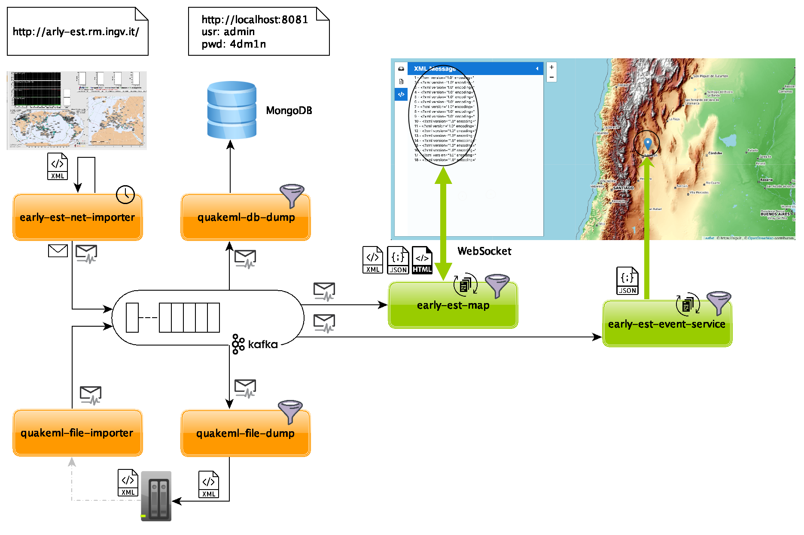

<!-- PROJECT SHIELDS -->
<!--
*** I'm using markdown "reference style" links for readability.
*** Reference links are enclosed in brackets [ ] instead of parentheses ( ).
*** See the bottom of this document for the declaration of the reference variables
*** for contributors-url, forks-url, etc. This is an optional, concise syntax you may use.
*** https://www.markdownguide.org/basic-syntax/#reference-style-links
-->

[![Contributors][contributors-shield]][contributors-url]
[![Forks][forks-shield]][forks-url]
[![Stargazers][stars-shield]][stars-url]
[![Issues][issues-shield]][issues-url]
[![MIT License][license-shield]][license-url]
[![LinkedIn][linkedin-shield]][linkedin-url]

<!-- PROJECT LOGO -->
<br />
<p align="center">
  <!-- a href="https://github.com/Odyno/ingv-early-est-poc">
    
  </a -->

  <h3 align="center">Early-Est Proof Of Concept</h3>

  <p align="center">
    Data management & Realtime data display
    <br />
    <!--a href="https://github.com/Odyno/ingv-early-est-poc"><strong>Explore the docs »</strong></a>
    <br />
    <br />
    <a href="https://github.com/Odyno/ingv-early-est-poc">View Demo</a>
    ·-->
    <a href="https://github.com/Odyno/ingv-early-est-poc/issues">Report Bug</a>
    ·
    <a href="https://github.com/Odyno/ingv-early-est-poc/issues">Request Feature</a>
  </p>
</p>

<!-- TABLE OF CONTENTS -->

## Table of Contents

- [About the Project](#about-the-project)
  - [Built With](#built-with)
- [Getting Started](#getting-started)
  - [Prerequisites](#prerequisites)
  - [Installation](#installation)
- [Usage](#usage)
<!-- - [Roadmap](#roadmap)
- [Contributing](#contributing)
- [License](#license)
- [Contact](#contact)
<!-- - [Acknowledgements](#acknowledgements) -->

<!-- ABOUT THE PROJECT -->

## About The Project

<p align="center">
    <a href="doc/imgs/POC.png" alt="Schema" target="_new">
        
    </a>
</p>

Lo scopo di questo proggetto è creare un POC di una infrastruttura capace di gestire eventi realtime sismici. L'idea è proporre una architettura che deve avere la caratteristica di estendibile, scalabile ed agnostica.

Il caso d’uso è la realizzazione di un sistema di management e classification degli eventi sismici provenienti dal sistema realtime noto come “Early-Est”

E' usato Apache Kafka, un (e non solo) consolidato pattern del publish/subscribe su una infrastruttura moderna e scalabile. Alcune delle caratteristiche che Apache Kafka è in grado di fornire nativamente per questo POC:

- La possibilità di inserire dati in ingresso come flusso diretto o come offline bulk. Chi utilizzerà il dato utilizzerà un flusso dati e non sará influenzato dalle caratteristiche intrinseche della fonte dei dati.
- La possibilità di creare pipeline con attori non legati tra loro. Ogni step della pipeline produce/arricchisce/riduce il dato e lo mette a disposizione senza sapere chi in seguito ne farà uso
- Architettura poliglotta. Ci sono diversi modi di interrogare Kafka: esistono librerie in C#, Java, C, Python ed altro. L'ecosistema potrebbe fornisce anche proxy REST che permette integrazione via HTTP e JSON.
- Kafka è scalabile. Grazie ad una architettura distribuita ed ad una configurazione adeguata è possibile scalare su piú nodi senza incorrere in downtime.

Il setup di questa architettura è basata su un single broker di kafka, eseguita tramite Docker CE.
Gli applicativi possono essere creati ed eseguiti indipendentemente dal linguaggio e dall'ambiente di esecuzione: per semplicità in questo POC sono tutti applicativi NodeJS.

### Built With

Elenca tutti i principali framework che hai utilizzato:

- [Docker CE](https://docs.docker.com/)
- [NodeJS](https://nodejs.org/)

<!-- GETTING STARTED -->

## Getting Started

To get a local copy up and running follow these simple example steps.

### Prerequisites

Le cose necessarie per utilizzare il software e come installarle.

- Docker: seguire la guida https://docs.docker.com/get-docker/
- npm : seguire la guida https://nodejs.org/it/

### Installation

1. Clone the repo

```sh
git clone https://github.com/your_username_/Project-Name.git
```

2. Run the Kafka Environment via docker-compose

```sh
docker-compose -f env/docker-compose.yml -d
```

3. Foreach Modules you can run the follow commands:

   - Install the library/depency `npm install`
   - Per eseguire il servizio `npm start`
   - Per sviluppare il servizio `npm run dev`

<!-- USAGE EXAMPLES -->

## Usage

The documentation in in progress, For more examples, please refer to the buildig in progress [Documentation](https://www.staniscia.net)

<!-- ROADMAP --

## Roadmap

See the [open issues](https://github.com/Odyno/ingv-early-est-poc/issues) for a list of proposed features (and known issues).

<!-- CONTRIBUTING -->

## Contributing

Contributions are what make the open source community such an amazing place to be learn, inspire, and create. Any contributions you make are **greatly appreciated**.

1. Fork the Project
2. Create your Feature Branch (`git checkout -b feature/AmazingFeature`)
3. Commit your Changes (`git commit -m 'Add some AmazingFeature'`)
4. Push to the Branch (`git push origin feature/AmazingFeature`)
5. Open a Pull Request

<!-- LICENSE -->

## License

Distributed under the MIT License. See `LICENSE` for more information.

<!-- CONTACT -->

## Contact

Alessandro Staniscia - [@alexstani](https://twitter.com/alexstani) - alessandro @ staniscia.net - https://www.staniscia.net

Project Link: [https://github.com/Odyno/ingv-early-est-poc](https://github.com/Odyno/ingv-early-est-poc)

<!-- ACKNOWLEDGEMENTS --

## Acknowledgements

- [GitHub Emoji Cheat Sheet](https://www.webpagefx.com/tools/emoji-cheat-sheet)
- [Img Shields](https://shields.io)
- [Choose an Open Source License](https://choosealicense.com)
- [GitHub Pages](https://pages.github.com)
- [Animate.css](https://daneden.github.io/animate.css)
- [Loaders.css](https://connoratherton.com/loaders)
- [Slick Carousel](https://kenwheeler.github.io/slick)
- [Smooth Scroll](https://github.com/cferdinandi/smooth-scroll)
- [Sticky Kit](http://leafo.net/sticky-kit)
- [JVectorMap](http://jvectormap.com)
- [Font Awesome](https://fontawesome.com)

<!-- MARKDOWN LINKS & IMAGES -->
<!-- https://www.markdownguide.org/basic-syntax/#reference-style-links -->

[contributors-shield]: https://img.shields.io/github/contributors/othneildrew/Best-README-Template.svg?style=flat-square
[contributors-url]: https://github.com/Odyno/ingv-early-est-poc/graphs/contributors
[forks-shield]: https://img.shields.io/github/forks/othneildrew/Best-README-Template.svg?style=flat-square
[forks-url]: https://github.com/Odyno/ingv-early-est-poc/network/members
[stars-shield]: https://img.shields.io/github/stars/othneildrew/Best-README-Template.svg?style=flat-square
[stars-url]: https://github.com/Odyno/ingv-early-est-poc/stargazers
[issues-shield]: https://img.shields.io/github/issues/othneildrew/Best-README-Template.svg?style=flat-square
[issues-url]: https://github.com/Odyno/ingv-early-est-poc/issues
[license-shield]: https://img.shields.io/github/license/othneildrew/Best-README-Template.svg?style=flat-square
[license-url]: https://github.com/Odyno/ingv-early-est-poc/blob/master/LICENSE.txt
[linkedin-shield]: https://img.shields.io/badge/-LinkedIn-black.svg?style=flat-square&logo=linkedin&colorB=555
[linkedin-url]: https://www.linkedin.com/in/stanisciaalessandro
